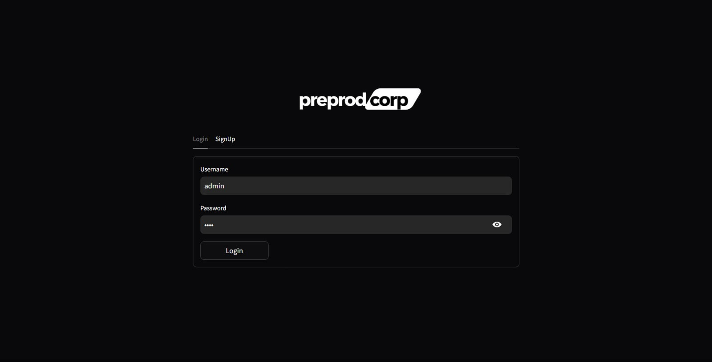
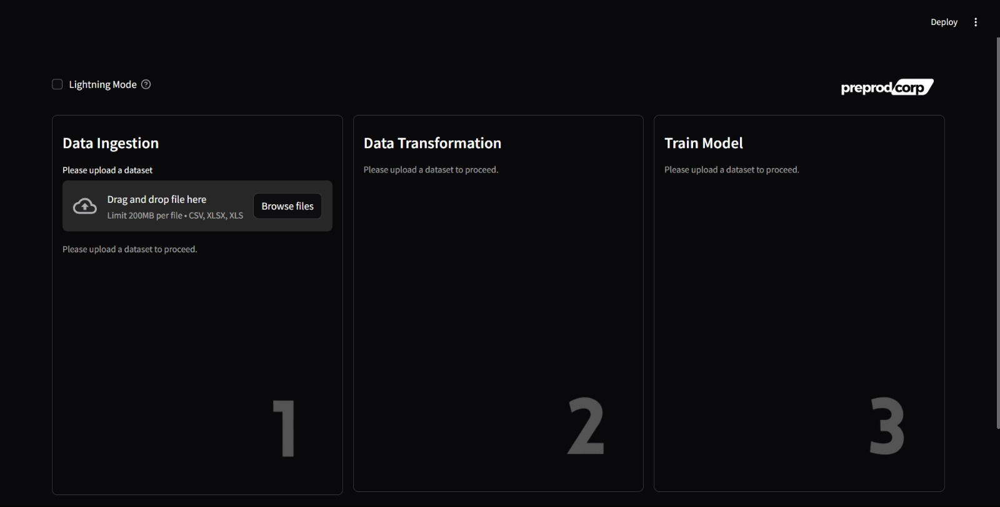
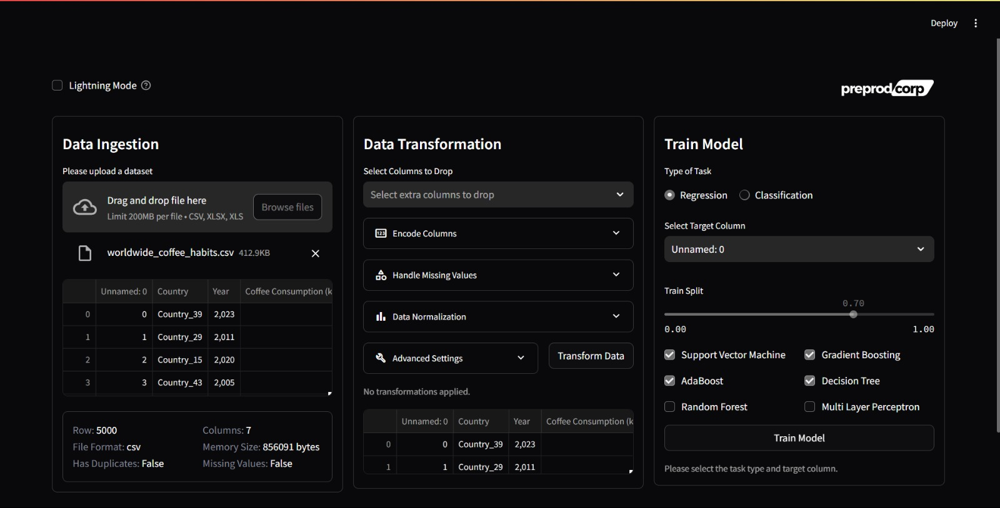
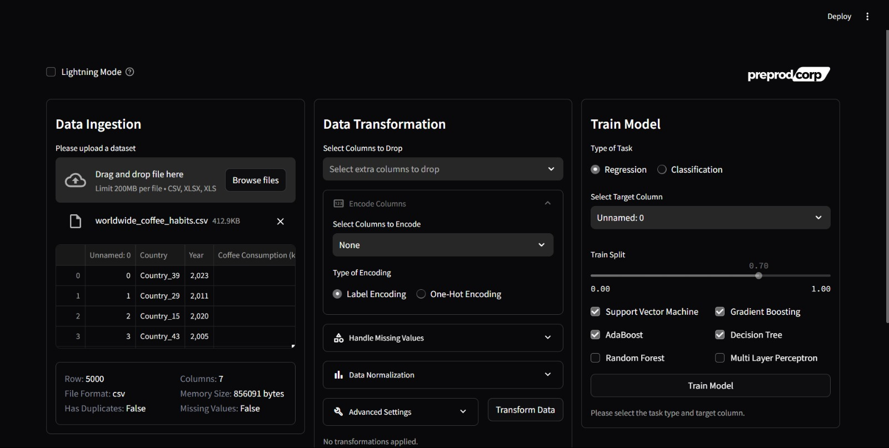
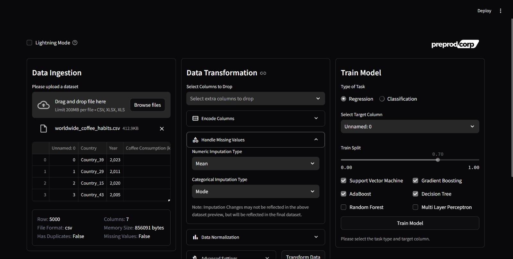
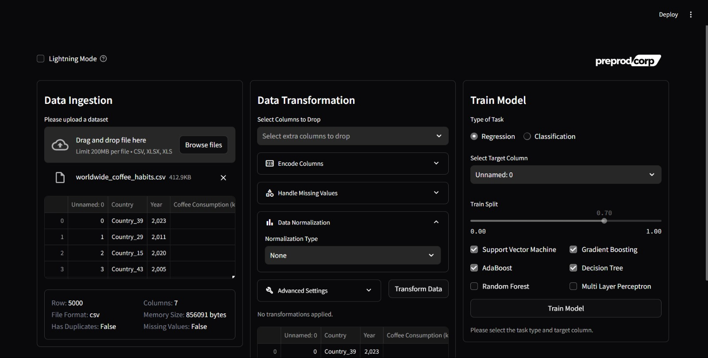
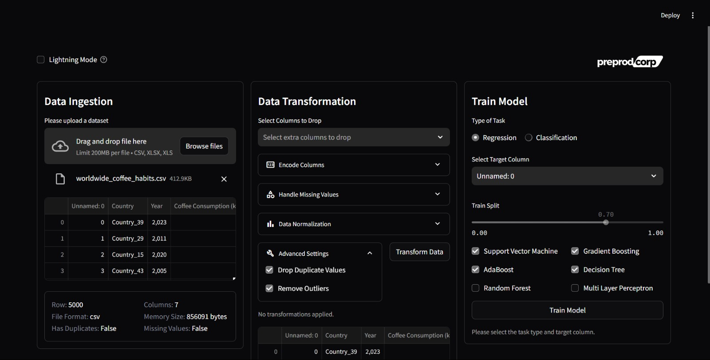
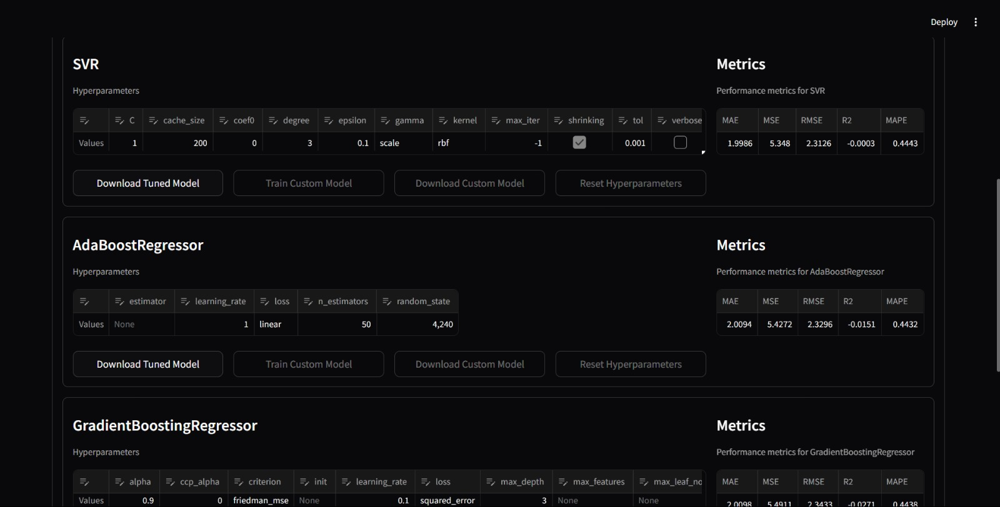

# **User Manual: Quick Start Guide**

Welcome to our platform! Follow this guide to quickly get started with your data analysis journey.

## **Login or Register**
First things first, let's get you logged in or registered if you're a first-time user. The process is simple and straightforward.

---

## **Uploading Your Data**
Drag and drop your dataset or select it using the discovery window. We support CSV and Excel formats.

---

## **View and Explore Your Data**
Once your dataset is uploaded, it will be displayed below. Here, you can explore various options to train and refine your data.

---

## **Step 1: Label Encoding**
Start by encoding your categorical data into numerical labels. This is an essential step for most machine learning algorithms.

---

## **Step 2: Handling Missing Values**
Easily handle any missing data in your dataset. We provide multiple options to fill or discard missing values.

---

## **Step 3: Data Normalization**
Normalize your data to ensure that all features contribute equally to the model. This step is crucial for models sensitive to feature scaling.

---

## **Step 4: Train-Test Split**
Split your data into training and testing sets. This allows you to evaluate your model's performance on unseen data.

---

## **Step 5: Model Training**
Choose from various algorithms (classification or regression) to train your model. Select the target column and let the platform do the rest!

---

## **Final Step: Review Results**
Wait for the processing to complete, and then review detailed results of your model's performance.

---

## **You're All Set!**
That’s it! You’ve successfully navigated through the basic steps. Dive deeper into your data, explore different models, and refine your analysis further.
